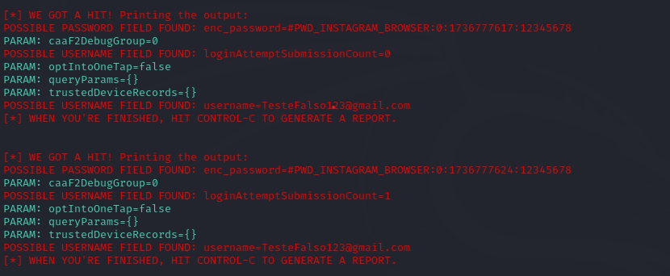

<h1>Projeto Phishing<h1></h1>

Este projeto contém os passos para configurar um ataque de phishing usando o SEToolkit no Kali Linux. 
**Somente para fins educacionais.**
**Projeto de atividade do Bootcamp de Cibersegurança do Santander, não utilizar o código para atividades ilícitas!!**

## Comandos Executados:

1. Sudo su: para acessar a VM no modo Root.
2. Setoolkit: Para iniciar o Setoolkit.
3. Tipo de ataque: Social-Engineering Attack (1).
4. Vetor de ataque: Web Site Attack Vectors (2).
5. Método de ataque: Credential Harvester Attack Method (3).
6. Método de ataque: Site Cloner (2).

Comando para obter o IP da máquina (que será utilizada como servidor para hospedar o ataque phishing): Ifconfig.
URL para clone: http://www.instagram.com

Resultado: o Phising foi executado com sucesso.

OBS: Foi utilizado o Instagram para teste, pois ao realizar as tentativas no Facebook, o Setoolkit não conseguiu capturar as credenciais.  

